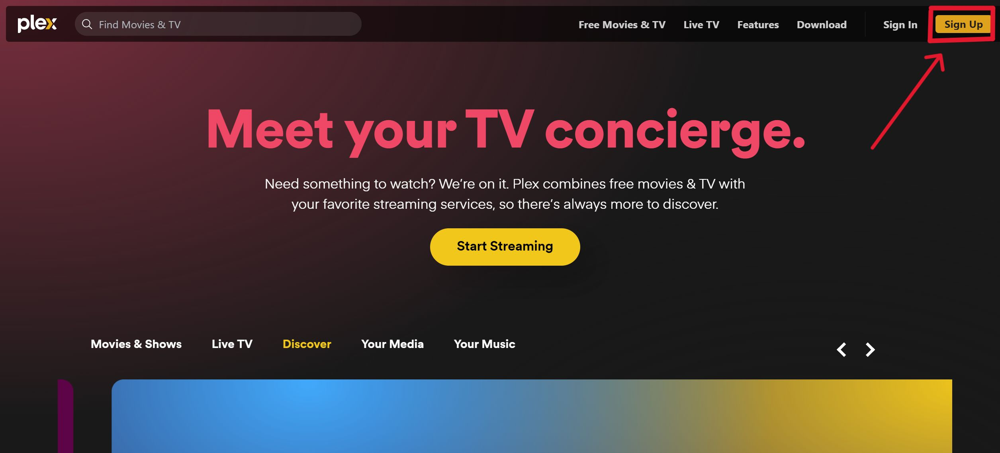
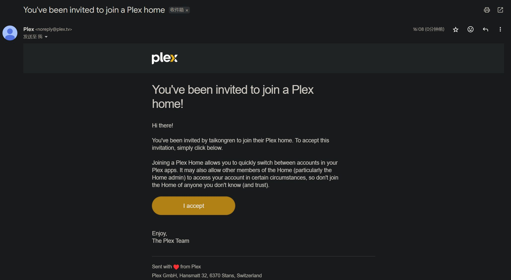
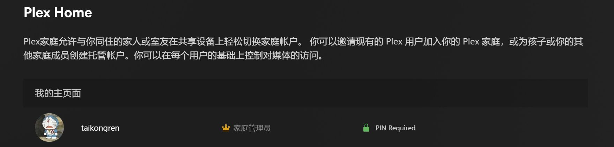

# 账号相关
:::warning
部分步骤可能需要科学上网，全过程建议使用电脑浏览器
两个媒体端全部支持，自行选择即可
:::
## Plex（推荐）
### 注册Plex账号
[Plex官网](https://www.plex.tv/)自行注册即可，国内可能存在官网无法打开的情况（请自行科学上网）。

### 账号设置
注册账号后，在网站登录，点击右上角头像，可以进行账号相关的设置
**必要：**

- PIN设置：在 “Plex Home”中设置PIN码。作用是防止别人登录自己的账号，导致观看记录等的隐私泄露
- 隐私设置：在“隐私”->“账户的可见性&活动分享”中设置可见性为“私人”。防止别人看到自己的观看几率
- 同步观看历史：在“账号”-> “同步我的观看状态和评分”中设置为“是”。确保跨平台观看时的进度同步

**非必要：**

- 更改密码：在“账号”->“安全”中更改密码，开启双重验证（首先要验证电子邮件地址），提高账号的安全性。
### 加入Plex家庭组
成功注册账号之后，将注册账号的用户名或邮箱提供给我，我手动邀请你加入Plex家庭组，即共享我的媒体服务器资源给你。
邀请以邮件的方式发送到你的邮箱中，请注意查收，收到后点击 I accept 即可。
> Q：如何获取账号的用户名或是邮箱
> A：注册成功后，在网页登录，然后点击右上角头像 -> 账户设置 , 即可查看当前账户详细信息

成功加入我的家庭组后，在“Plex Home”是这样的显示。

### 查看媒体库
在 [Plex 主页](https://app.plex.tv/desktop/#!/) 左上角展开左侧导航栏，点击“更多”，将“taikongren”对应的所有列表固定到主页中（在每个栏目中右侧的三个点，点击固定），并把原有的“Plex”的列表全部取消固定。
## Emby
### 注册Emby账号
采用[jfa-go](https://github.com/hrfee/jfa-go)项目来进行用户管理，实行私人邀请制，我手动发送邀请的方式来注册账号。可以通过邮件注册，也可以在线注册。（邀请的用户有30天有效期）。
成功注册后可以在[这里](https://jfa.taikong.co/)查看自己的账号信息，更改密码，邀请其他人加入Emby。
