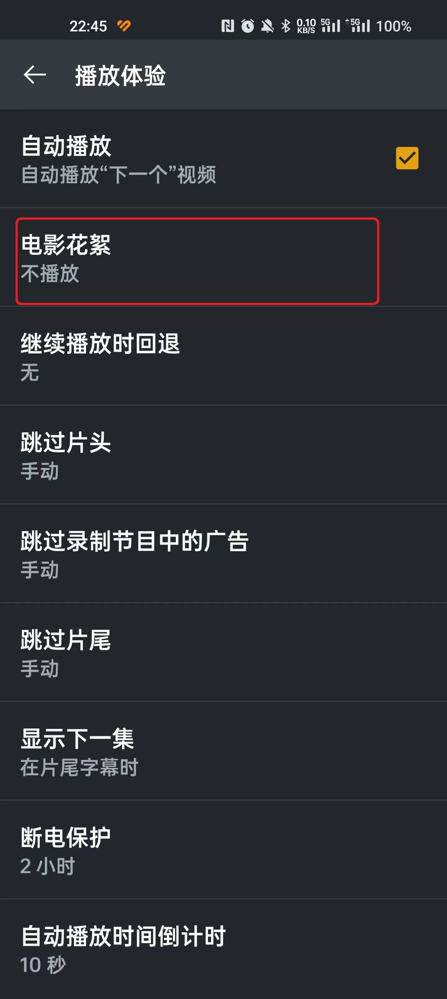
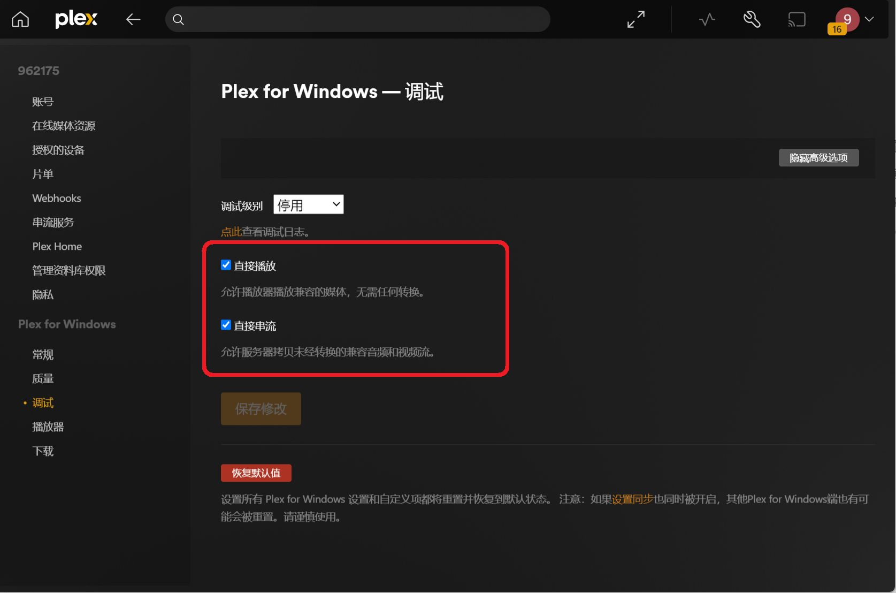

# 软件设置
:::tip
按照自己对应的客服端查看即可  
**给出的截图中，圈住的设置务必保持一致  **
没有涉及到的选项，请自行探索，自行体验  
:::
## 通用设置
在所有的 **Plex 客户端 **中，需要固定的来源有且仅有图中打钩的部分，其他选项全部关闭即可

## Plex 安卓端
> 最后一张图的播放器设置：“设置”-> “高级”-> “播放器”

## Plex HTPC Windos 端
> 同 Plex 安卓端基本相同，可以参考设置，这里只给出一些特别的设置项

## Plex Windows 端
> 同理，只展示特殊的设置

## Yamby

