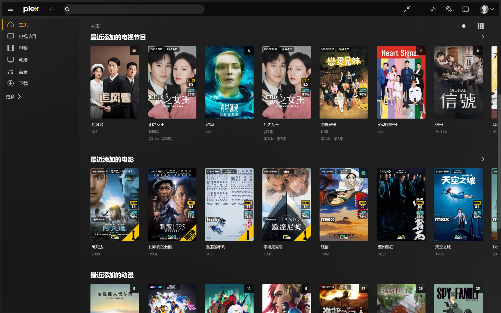
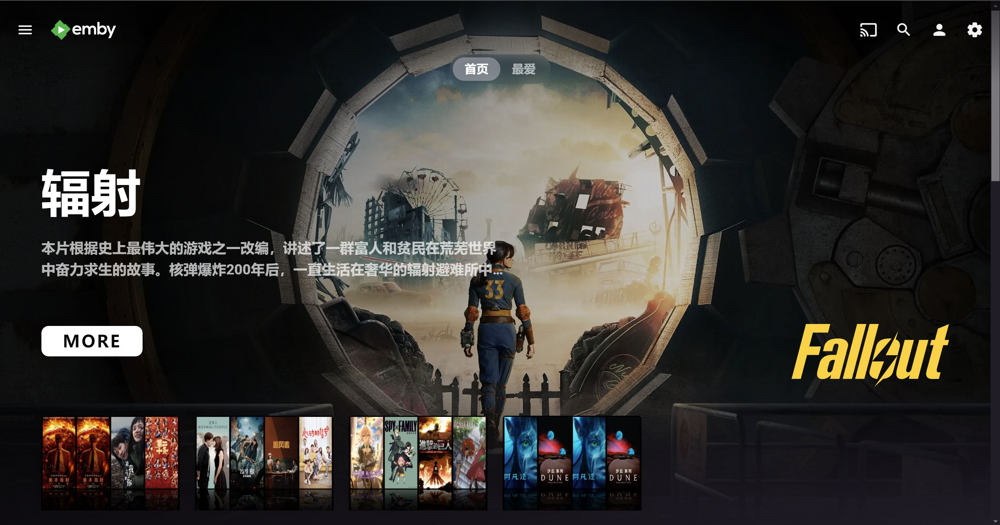
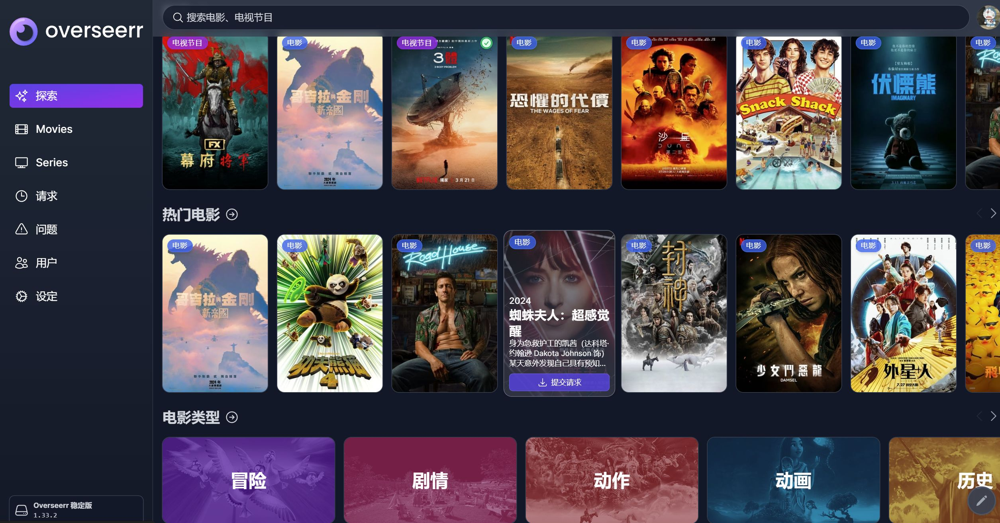
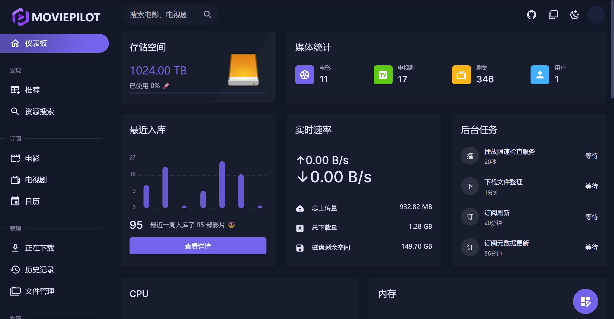

# 简介
个人搭建的一站式媒体服务器，目前实现的功能是通过求片订阅的方式，后台自动搜索对应的资源下载到媒体服务器上，实现半自动观影。
**服务架构**

- 媒体服务：Plex、Emby
- 媒体管理：MoviePilot
- 用户管理：jfa-go
- 订阅管理：AutoBangumi，Overseerr
- 资源下载：qBittorrent
- 云盘存储：GoogleDrive
- 软件下载：Alist
## 效果截图

